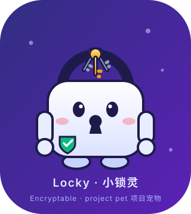
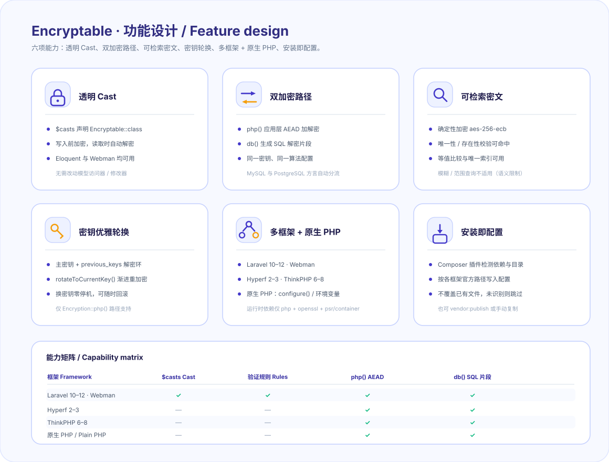
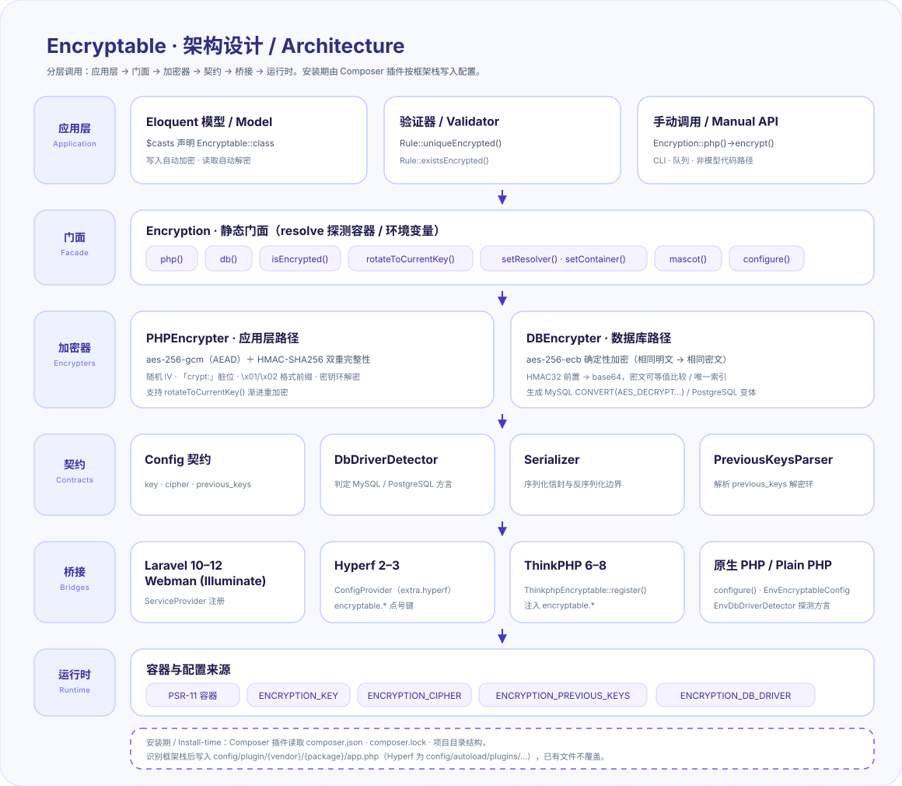
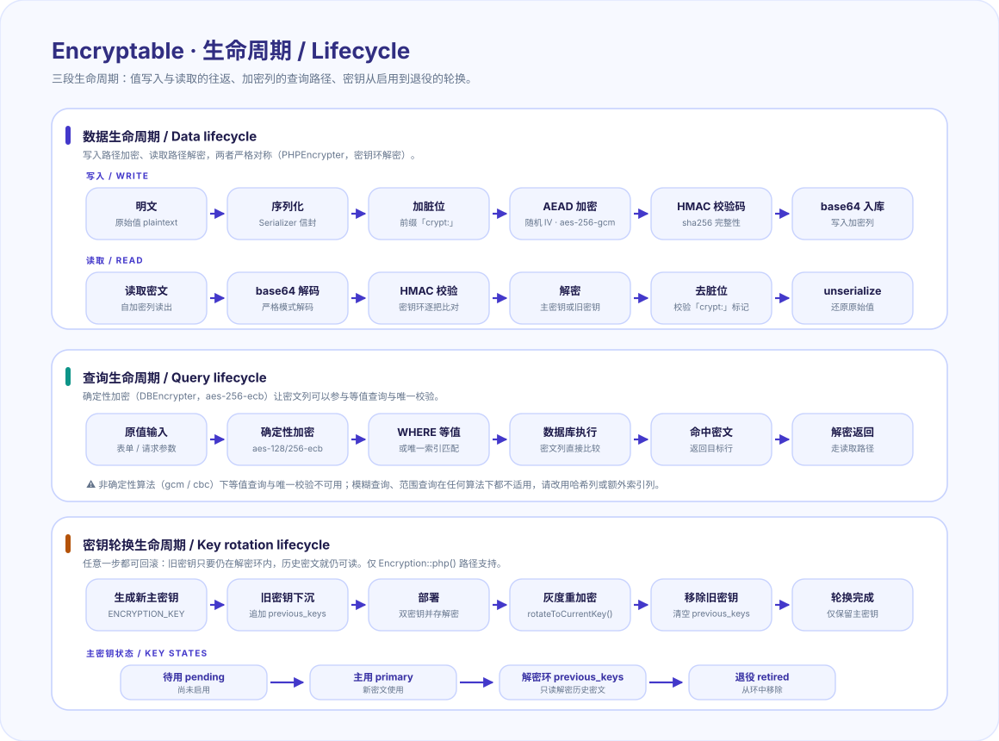

**Languages:** **English (this page)** | [简体中文](docs/README.zh-CN.md)

---

# Encryptable (`erikwang2013/encryptable`)



On **PHP 8.0+** (dev toolchain: 8.2+), this package helps you **anonymize / encrypt sensitive attributes in a query-friendly way**: values are encrypted before persistence and decrypted when read through Eloquent (or manual APIs). It can also emit **MySQL / PostgreSQL**-compatible SQL fragments so you can compare or search against encrypted columns in raw queries. Frameworks are optional — the same two crypto paths run in **plain native PHP** via `Encryption::configure()` or environment variables.

This repository evolves from the ideas and behaviour of **[laravel-encryptable](https://github.com/maize-tech/laravel-encryptable)** (Maize Tech). For the original design, issues, and releases, refer to that upstream project.

---

## Project overview

### What this package solves

Applications that handle personally identifiable information (PII), health records, financial data, or secrets often need to store those values **encrypted at rest** — not just hashed or masked — while keeping the ability to **query by the original value** (unique checks, existence lookups). Pure-encryption libraries leave you to implement the persistence layer yourself; ORM-only solutions lock you into one framework. This package bridges both gaps.

### Core design

- **Dual crypto path** — `Encryption::php()` for application-level encrypt/decrypt (OpenSSL, the same path Eloquent casts use), and `Encryption::db()` for generating SQL fragments that decrypt inside the database engine. The two paths share the same key and cipher config.
- **Authenticated encryption by default** — the default cipher `aes-256-gcm` provides confidentiality and integrity via AEAD. If deterministic encryption is needed (required for `UniqueEncrypted` / `ExistsEncrypted` validation rules), switch to `aes-128-ecb` (identical plaintext → identical ciphertext) or another non-AEAD cipher.
- **Container-agnostic resolution** — `Encryption::resolve()` probes Hyperf, Laravel, and a user-supplied PSR-11 container; when none is available it falls back to `Encryption::configure([...])`, then to the `ENCRYPTION_KEY` / `ENCRYPTION_CIPHER` env vars. Framework bridges exist for **Laravel 10–12**, **Webman** (Illuminate), **Hyperf 2–3**, and **ThinkPHP 6–8**; **plain PHP** needs no bridge at all.
- **Zero-downtime key rotation** — a primary key + `previous_keys` ring lets you rotate secrets without a big-bang re-encrypt. `rotateToCurrentKey()` provides gradual ciphertext migration under live traffic.

### What this fork adds (beyond upstream `laravel-encryptable`)

| Area | Extension |
|------|-----------|
| **Multi-framework** | Bridges for Webman, Hyperf, and ThinkPHP in addition to Laravel/Lumen. |
| **Composer plugin** | Auto-publishes config files for the detected framework stack on install/update. |
| **Key rotation** | `previous_keys` ring + `PreviousKeysParser` + `rotateToCurrentKey()` (upstream only handles a single key). |
| **Container resolution** | `Encryption::setResolver()` / `setContainer()` callbacks so non-Laravel stacks can plug in without touching the core. |
| **Type coverage** | Return types on all public/protected methods; PHP 8.2+ baseline. |
| **Config layout** | Unified `config/plugin/{vendor}/{package}/app.php` layout shared across Webman, Laravel, ThinkPHP; Hyperf autoload path for its dotted-key convention. |

### When to use (and when not to)

| Use this package when | Consider alternatives when |
|------------------------|----------------------------|
| You need Eloquent attribute encryption that "just works" with `$casts`. | You need full-disk or filesystem-level encryption (use LUKS, AWS EBS encryption, etc.). |
| You need to run uniqueness/existence checks against encrypted columns. | You don't need queryability and prefer stronger authenticated encryption (e.g. libsodium's `secretbox`). |
| You ship to multiple PHP frameworks and want one encryption contract. | You only target one framework and prefer its native encryption (e.g. Laravel's built-in `encrypted` cast). |
| You need to rotate encryption keys with zero downtime. | Your threat model requires per-row IVs/nonces and HMAC authentication. |

### Project pet: Locky · 小锁灵

<div align="center"></div>

**Locky** is the pet of this package, and it is drawn from the design rather than bolted onto it: the **amber key** on its ring is the current primary key, and the **two grey keys** are `previous_keys` — still on the ring, still able to decrypt old ciphertext, until you retire them. That is the key-rotation model below, as a mascot.

It ships as part of the code, not only as documentation:

| Call | Returns |
|------|---------|
| `Encryption::mascot()` / `Mascot::svg()` | The raw `docs/pet.svg` markup (`''` if `docs/` is not shipped). |
| `Mascot::dataUri()` | `data:image/svg+xml;base64,…` — drop straight into ``. |
| `Mascot::ascii()` | A monospace pet for CLI output (the Composer plugin prints it on install). |
| `Mascot::NAME` | `'Locky · 小锁灵'`. |

```php
use Erikwang2013\Encryptable\Encryption;

echo Encryption::mascot();   // SVG markup for an admin page or error screen
```

Purely decorative: no pet method touches keys, ciphers or payloads.

---

## Features



- **Eloquent custom cast**: use `Encryptable::class` in `$casts` for transparent encrypt/decrypt on attributes.
- **PHP-side crypto**: `Encryption::php()->encrypt()` / `decrypt()` for CLI, queues, or non-model code paths.
- **DB expressions**: `Encryption::db()->decrypt()` returns a SQL snippet (MySQL vs Postgres branches) suitable for `whereRaw`-style comparisons against stored ciphertext.
- **Validation**: `UniqueEncrypted`, `ExistsEncrypted`, and `Rule::uniqueEncrypted()` / `Rule::existsEncrypted()` macros (requires `illuminate/validation`).
- **Multi-runtime bridges + native PHP**: Laravel **10–12**, Illuminate-based **Webman**, **Hyperf 2–3**, and **ThinkPHP 6–8** each register container/config in their own way. With **no framework at all**, `Encryption::configure(['key' => …])` or the env vars **`ENCRYPTION_KEY`**, **`ENCRYPTION_CIPHER`**, optional **`ENCRYPTION_PREVIOUS_KEYS`** and **`ENCRYPTION_DB_DRIVER`** drive both `Encryption::php()` and `Encryption::db()` (see **Supported frameworks → Native PHP**).
- **Composer install hook**: this package is a **Composer plugin**; on `composer require` / `composer update`, it inspects **`vendor/composer/installed.php`**, lock, manifest, and **project layout** to publish config for the stack in use (see **Installation → Composer plugin**).
- **Key rotation (`Encryption::php()` only)**: primary + `previous_keys` / `ENCRYPTION_PREVIOUS_KEYS` decryption ring, optional `rotateToCurrentKey()` for gradual re-encryption — full behavior and rollout are documented under **Configuration → Key rotation**.

---

## Architecture



Every entry point — the Eloquent cast, a validation rule, or a manual `Encryption::php()` call — goes through the same static facade. The facade resolves a **`PHPEncrypter`** (application-level AEAD) or a **`DBEncrypter`** (deterministic ciphertext plus SQL decrypt fragments) from the framework container, or from environment variables when no container is available. Bridges only provide config and container bindings: the crypto core itself has no framework dependency (runtime `require` is just `php`, `ext-openssl`, `psr/container`).

### Lifecycle



- **Data** — write and read are strictly symmetric: `serialize → dirty bit → random IV + AEAD → HMAC → base64` on the way in, and the exact reverse on the way out. Any key still on the ring can decrypt.
- **Query** — only deterministic ciphers (`aes-*-ecb`) can be compared inside the database engine; fuzzy and range lookups never work against ciphertext, whatever the cipher.
- **Key rotation** — a key walks `pending → primary → previous_keys → retired`. Rollback is safe at any step while the old key is still on the ring.

---

## Project structure

```text
encryptable/
├── src/
│   ├── Encryption.php                  # static facade: php() · db() · isEncrypted() · rotateToCurrentKey() · mascot()
│   ├── Encrypter.php                   # abstract base: key/cipher validation, decryption key ring
│   ├── PHPEncrypter.php                # application path: AEAD + HMAC, random IV, \x01/\x02 payload formats
│   ├── DBEncrypter.php                 # DB path: deterministic AES-ECB + SQL decrypt fragments
│   ├── Encryptable.php                 # Eloquent cast (CastsAttributes)
│   ├── EncryptableServiceProvider.php  # Laravel/Webman provider: publishes config, registers validation macros
│   ├── Config/                         # ArrayEncryptableConfig · EnvEncryptableConfig · EnvDbDriverDetector (native PHP)
│   ├── Contracts/                      # EncryptableConfigContract · DbDriverDetector
│   ├── Exceptions/                     # Decrypt · Encrypt · MissingKey · MissingCipher · (Un)Serialization
│   ├── Rules/                          # UniqueEncrypted · ExistsEncrypted
│   ├── Support/                        # PackagePluginPaths · PreviousKeysParser · Mascot (the pet)
│   ├── Utils/Serializer.php            # serialization envelope shared by both encrypters
│   ├── Bridge/
│   │   ├── Laravel/                    # Illuminate config + DB driver detector
│   │   ├── Webman/                     # native Webman plugin config reader
│   │   ├── Hyperf/                     # ConfigProvider, config, DB driver detector
│   │   └── ThinkPHP/                   # ThinkphpEncryptable::register(), config, PSR-11 adapter
│   └── Composer/Plugin.php             # install/update hook: publishes config for the detected stack
├── config/
│   ├── encryptable.php                 # legacy flat config (still merged)
│   └── stubs/                          # plugin-app · webman-plugin-app · hyperf-plugin-autoload · hyperf-autoload-encryptable
├── docs/
│   ├── pet.svg                         # Locky · 小锁灵 — the project pet
│   ├── architecture.svg                # architecture diagram
│   ├── features.svg                    # feature design
│   ├── lifecycle.svg                   # value / query / key-rotation lifecycles
│   └── README.zh-CN.md                 # Chinese README
├── tests/                              # 19 PHPUnit test classes (cast, encrypters, key ring, bridges, native PHP, rules, config)
├── .github/workflows/                  # ci.yml (PHP 8.2–8.4 + PHP 8.0 syntax check) · release.yml
├── composer.json                       # composer-plugin entry point + framework metadata
├── phpstan.neon.dist · phpunit.xml
└── README.md
```

---

## Requirements

| Item | Notes |
|------|--------|
| PHP | `^8.0` with the `openssl` extension. Runtime supports PHP 8.0+ (no 8.1+ API is used anywhere in `src/`; CI checks syntax on 8.0 and runs the suite on 8.2–8.4); the dev toolchain (PHPUnit 11 / Pest / Larastan) requires PHP 8.2+ |
| Databases | Docs and SQL helpers target **MySQL** and **PostgreSQL** (driver name is used to pick the dialect for `Encryption::db()`). |
| Extensions (optional) | `ext-pdo` — only for the native-PHP dialect probe (`new EnvDbDriverDetector(null, $pdo)`); `ENCRYPTION_DB_DRIVER` or `db_driver` covers the same ground without PDO. |

Packagist: **[erikwang2013/encryptable](https://packagist.org/packages/erikwang2013/encryptable)** (`name` in `composer.json`).

---

## Supported frameworks

The table below summarizes **expected compatibility**, how to wire the package, and which features are Laravel-specific (Eloquent cast, `illuminate/validation` rules). Pin versions in your own project as needed. **Config files** are installed automatically by the Composer plugin when allowed (see Installation); you can still copy or `vendor:publish` manually if you prefer.

| Framework | Version (expected) | Integration | Eloquent `$casts` (`Encryptable`) | `Encryption::php()` | `Encryption::db()` | `UniqueEncrypted` / `ExistsEncrypted` & macros |
|-----------|--------------------|--------------|-------------------------------------|----------------------|---------------------|--------------------------------------------------|
| **Laravel** | 10.x–12.x (PHP ≥ 8.2) | Package discovery registers `EncryptableServiceProvider` + **`config/plugin/erikwang2013/encryptable/app.php`** (or legacy `config/encryptable.php`) | ✓ | ✓ | ✓ | ✓ |
| **Webman** | 1.x / 2.x with **Illuminate** (database / support / validation) | Register `EncryptableServiceProvider` + **`config/plugin/erikwang2013/encryptable/app.php`** (Composer plugin or manual) | ✓ (when using Eloquent) | ✓ | ✓ | ✓ |
| **Hyperf** | 2.x / 3.x | `extra.hyperf.config` merges `Bridge\Hyperf\ConfigProvider` + **`config/autoload/plugins/erikwang2013/encryptable.php`** (or legacy `config/autoload/encryptable.php`) | — (no Laravel cast; call `Encryption::php()` in entities/repos) | ✓ | ✓ (install `hyperf/db-connection`) | — (needs Illuminate validation stack) |
| **ThinkPHP** | 6.x–8.x | `ThinkphpEncryptable::register($app)` + **`config/plugin/erikwang2013/encryptable/app.php`** (or legacy `config/encryptable.php`) | — (use accessors/mutators or types with `Encryption::php()`) | ✓ | ✓ | — |
| **Native PHP** | ≥ 8.0, no framework | `Encryption::configure([...])`, or `ENCRYPTION_KEY` / `ENCRYPTION_CIPHER` / `ENCRYPTION_PREVIOUS_KEYS` / `ENCRYPTION_DB_DRIVER` | — (no Eloquent; call `Encryption::php()`) | ✓ | ✓ (`EnvDbDriverDetector`) | — (needs the Illuminate validation stack) |

**Legend:** ✓ = supported for this stack out of the box; — = not provided; integrate in your own layer.

### Native PHP (no framework, no container)

The package has no runtime dependency on any framework: `require` is only `php`, `ext-openssl` and `psr/container`. Point it at a key and it works — either from the environment or from an array.

```php
use Erikwang2013\Encryptable\Encryption;

// Option A — environment (12-factor style), nothing to configure in code:
//   ENCRYPTION_KEY=<32 bytes for aes-256-*>
//   ENCRYPTION_CIPHER=aes-256-gcm
//   ENCRYPTION_PREVIOUS_KEYS='old-key-1,old-key-2'   # optional
//   ENCRYPTION_DB_DRIVER=mysql|pgsql                 # optional, for Encryption::db()

// Option B — one array, no env vars, no config file:
Encryption::configure([
    'key' => $_ENV['APP_KEY'],              // 32 bytes for aes-256-*, 16 bytes for aes-128-*
    'cipher' => 'aes-256-gcm',              // default when omitted
    'previous_keys' => ['2025-key'],        // optional decryption ring
    'db_driver' => 'pgsql',                 // optional: MySQL/PostgreSQL SQL fragment dialect
]);

$ciphertext = Encryption::php()->encrypt($value);      // application path (AEAD + HMAC)
$plain      = Encryption::php()->decrypt($ciphertext);
$sql        = Encryption::db()->decrypt('phone');      // SQL fragment, dialect from db_driver/PDO/env
```

Notes for the native path:

- `Encryption::configure()` only fills the **fallback** slot. Container bindings and `Encryption::setResolver()` still win, so calling it inside Laravel/Hyperf changes nothing.
- `Encryption::db()` probes the dialect in this order: `db_driver` from `configure()` → `ENCRYPTION_DB_DRIVER` → a `PDO` connection you pass to `new EnvDbDriverDetector(null, $pdo)` → MySQL as the default.
- Payload types follow the serialization envelope: `string`, `int`, `float`, `bool`, `null` (`$serialize = true`, the default). With `$serialize = false` pass a scalar or a `Stringable` — arrays and objects throw `SerializationException` instead of a raw `TypeError`.
- `Encryption::isEncrypted()` recognises the **application-level** payload format only (`\x01`/`\x02` prefix); DB-format ciphertext is checked by the DB encrypter internally.
- Failed decryption is not fatal by default: `decrypt()` returns the input unchanged unless you pass `$strict = true` (`rotateToCurrentKey()` is always strict).

---

## Installation

```bash
composer require erikwang2013/encryptable
```

### Composer plugin (auto-publish config)

This package has `"type": "composer-plugin"` and registers `Erikwang2013\Encryptable\Composer\Plugin`. After **install** or **update** of `erikwang2013/encryptable`, Composer runs the plugin, which:

1. Collects Composer package names (lowercased) from, in order: **`vendor/composer/installed.php`** (and **`installed.json`** if present), **`composer.lock`**, then root **`composer.json`** `require` / `require-dev`. This matches **what is actually installed in `vendor/`**, including transitive Webman / Hyperf packages that never appear in your root `composer.json`.
2. Adds **filesystem hints** when needed (e.g. Webman: `support/bootstrap.php`, `start.php`, or `windows.php` plus `config/`; Laravel: `artisan` + `bootstrap/app.php` or `app/Http/Kernel.php`; Hyperf: `bin/hyperf.php` or `config/autoload/server.php`; ThinkPHP: executable `think` file in the project root).
3. Publishes files **only when a supported framework is detected** (see table). Existing target files are **never overwritten**.
4. If **nothing** matches, it prints a skip notice so plain PHP projects are not modified.

| Detected dependency (examples) | Official layout we follow | File we create when missing |
|--------------------------------|---------------------------|-----------------------------|
| `laravel/framework` or `laravel/lumen-framework` | [Laravel configuration](https://laravel.com/docs/configuration) — PHP under `config/` (same physical layout as Webman plugins for this package) | `config/plugin/erikwang2013/encryptable/app.php` (merged as `config('encryptable.*')` via `EncryptableServiceProvider`) |
| `workerman/webman` / `webman/*` | [Webman plugins](https://webman.workerman.net/doc/en/plugin/create.html) — `config/plugin/{vendor}/{name}/app.php` | `config/plugin/erikwang2013/encryptable/app.php` (`config('plugin.erikwang2013.encryptable.app.*')`) |
| `topthink/framework` or `topthink/think` | [ThinkPHP 8 config](https://doc.thinkphp.cn/v8_0/config_file.html) — project `config/`; plugin-style path for this package | `config/plugin/erikwang2013/encryptable/app.php` (injected as `encryptable.*` when you call `ThinkphpEncryptable::register`) |
| `hyperf/framework` or `hyperf/hyperf` | [Hyperf config](https://hyperf.wiki/en/config.html) — merge PHP files under `config/autoload/` (relative path becomes dot keys) | `config/autoload/plugins/erikwang2013/encryptable.php` (`plugins.erikwang2013.encryptable.*`; see `HyperfEncryptableConfig`) |

**Laravel / Lumen / ThinkPHP / Webman** share the same **`config/plugin/erikwang2013/encryptable/app.php`** template (`config/stubs/plugin-app.php`). **Hyperf** uses **`config/autoload/plugins/erikwang2013/encryptable.php`** when neither that file nor the legacy **`config/autoload/encryptable.php`** exists yet (legacy installs keep working; `HyperfEncryptableConfig` reads the plugin path first, then `encryptable.*`). If multiple stacks match (e.g. a monorepo), every applicable file is created when missing.

**Composer 2.2+** may block plugins until you allow them. Add this to your application `composer.json` (once), then run `composer require` again if needed:

```json
"config": {
    "allow-plugins": {
        "erikwang2013/encryptable": true
    }
}
```

Or approve the prompt Composer shows when requiring the package.

### Configuration files (manual copy, optional)

If the plugin is blocked or you manage config in VCS templates yourself, **copy the matching template from this package into the path your framework expects**, then adjust `.env` as needed.

| Framework | Source inside `vendor` (package `erikwang2013/encryptable`) | Destination in your project |
|-----------|--------------------------------------------------------------|------------------------------|
| **Laravel / Lumen / ThinkPHP / Webman** | `vendor/erikwang2013/encryptable/config/stubs/plugin-app.php` | `config/plugin/erikwang2013/encryptable/app.php` |
| **Laravel (legacy, optional)** | `vendor/erikwang2013/encryptable/config/encryptable.php` | `config/encryptable.php` (still merged by `EncryptableServiceProvider` if present and plugin file is absent) |
| **Hyperf (recommended)** | `vendor/erikwang2013/encryptable/config/stubs/hyperf-plugin-autoload.php` | `config/autoload/plugins/erikwang2013/encryptable.php` |
| **Hyperf (legacy)** | `vendor/erikwang2013/encryptable/config/stubs/hyperf-autoload-encryptable.php` | `config/autoload/encryptable.php` (top-level `key` / `cipher` → `encryptable.*`) |

> **Note:** **`plugin-app.php`** is the shared stub (top-level `key`, `cipher`). **Webman** reads it natively as `plugin.erikwang2013.encryptable.app.*`. **Laravel / Lumen** merge it into `encryptable.*`. **ThinkPHP** loads it in `ThinkphpEncryptable::register` into `encryptable.*`. **Hyperf** autoload files are keyed by path: the recommended file maps to **`plugins.erikwang2013.encryptable.*`**; the legacy filename `encryptable.php` maps to **`encryptable.*`**.

**Shell examples:**

```bash
# Laravel / Lumen / ThinkPHP / Webman (shared plugin layout)
mkdir -p config/plugin/erikwang2013/encryptable
cp vendor/erikwang2013/encryptable/config/stubs/plugin-app.php config/plugin/erikwang2013/encryptable/app.php

# Hyperf (recommended)
mkdir -p config/autoload/plugins/erikwang2013
cp vendor/erikwang2013/encryptable/config/stubs/hyperf-plugin-autoload.php config/autoload/plugins/erikwang2013/encryptable.php
```

Laravel alternative (`vendor:publish` publishes the plugin file, optional legacy flat file, and the Hyperf stub path for convenience):

```bash
php artisan vendor:publish --provider="Erikwang2013\Encryptable\EncryptableServiceProvider" --tag="encryptable-config"
```

### Laravel (remaining steps)

With package auto-discovery enabled, `Erikwang2013\Encryptable\EncryptableServiceProvider` is registered. Ensure **`config/plugin/erikwang2013/encryptable/app.php`** exists (Composer plugin or **Laravel** row / `vendor:publish`), or keep a legacy **`config/encryptable.php`** only.

### Webman (with Illuminate)

Install `illuminate/database`, `illuminate/support`, `illuminate/validation`, etc. as needed. Ensure the plugin config exists at **`config/plugin/erikwang2013/encryptable/app.php`** (the Composer plugin or `vendor:publish` creates it). Then register:

`Erikwang2013\Encryptable\EncryptableServiceProvider`

in your plugin/bootstrap code. Runtime reads **`config('plugin.erikwang2013.encryptable.app.key')`** and **`.cipher`**, per [Webman plugin config rules](https://webman.workerman.net/doc/en/plugin/create.html).

### Hyperf

1. Copy or auto-install config per the **Hyperf** row (`config/autoload/plugins/erikwang2013/encryptable.php`, or legacy `config/autoload/encryptable.php`). Values are read as **`plugins.erikwang2013.encryptable.key`** / **`.cipher`**, with fallback to **`encryptable.*`**.
2. This package declares `Erikwang2013\Encryptable\Bridge\Hyperf\ConfigProvider` under `composer.json` → `extra.hyperf.config` for Hyperf to merge.
3. For `Encryption::db()`, install **`hyperf/db-connection`**.

### ThinkPHP

1. Prefer **`config/plugin/erikwang2013/encryptable/app.php`** (same stub as Webman/Laravel). Legacy **`config/encryptable.php`** still works if you do not use the plugin path.
2. During application bootstrap (e.g. service registration), call:

```php
\Erikwang2013\Encryptable\Bridge\ThinkPHP\ThinkphpEncryptable::register($app);
```

---

## Configuration

After copying or publishing **`config/plugin/erikwang2013/encryptable/app.php`**, legacy **`config/encryptable.php`**, or Hyperf’s **`config/autoload/plugins/erikwang2013/encryptable.php`** / **`config/autoload/encryptable.php`**, the main keys are:

| Key | Description |
|-----|-------------|
| `key` | Primary secret key, from `ENCRYPTION_KEY`. New ciphertext is always produced with this key. |
| `cipher` | Cipher id, default `aes-256-gcm`, from `ENCRYPTION_CIPHER`; keep aligned with DB defaults and any existing data contract. **All keys in the ring must use this cipher.** |
| `previous_keys` | Retired keys still tried for **decrypt** after the primary fails (same cipher). From `ENCRYPTION_PREVIOUS_KEYS` (comma-separated or JSON array) or the `previous_keys` config entry. |

Without Laravel / bindings, `Encryption::php()` can still read **`ENCRYPTION_KEY`**, **`ENCRYPTION_CIPHER`**, and **`ENCRYPTION_PREVIOUS_KEYS`** via `EnvEncryptableConfig`.

### Key rotation (elegant zero-downtime)

You can **change the primary encryption key without taking the app offline for a big-bang re-encrypt**: new data is sealed with the new primary; existing rows keep decrypting as long as the key that produced them still appears in the configured ring (primary or `previous_keys`).

#### Behavior summary (what this package implements)

| Area | Behavior |
|------|----------|
| **Config contract** | `EncryptableConfigContract::getPreviousKeys(): array` — retired keys used **only after** the primary `getKey()` fails to produce valid plaintext. Implemented for Laravel (`encryptable.previous_keys`), Webman plugin `app.php`, Hyperf (`plugins.*` / `encryptable.*`), ThinkPHP (`encryptable.previous_keys`), and `EnvEncryptableConfig` (`ENCRYPTION_PREVIOUS_KEYS`). |
| **Parsing** | `Erikwang2013\Encryptable\Support\PreviousKeysParser` turns `ENCRYPTION_PREVIOUS_KEYS` or config into a `list<string>`: comma-separated values, or a JSON array string (e.g. `["k1","k2"]`), or an already-loaded PHP array. |
| **Key ring** | `Encrypter::getDecryptionKeyRing()` builds `[primary, …previous]` with empty strings and duplicate keys removed. **All keys in the ring must share the same `cipher`.** |
| **Encrypt** | `PHPEncrypter::encrypt()` always uses the **primary** key only (`getKey()`). |
| **Decrypt & `isEncrypted()`** | For each ring key, OpenSSL decrypt is tried; success requires decrypted payload to start with the internal dirty prefix (`crypt:`), so random garbage from a wrong key is not treated as valid. Same logic powers Eloquent `Encryptable` casts via `Encryption::php()`. |
| **Re-encrypt API** | `PHPEncrypter::rotateToCurrentKey(?string $payload, bool $serialize = true)` decrypts with the ring then re-encrypts with the **current** primary. **`Encryption::php()->rotateToCurrentKey(...)`** delegates to it. Non-encrypted payloads are returned unchanged; `null` stays `null`. |
| **Out of scope** | **`Encryption::db()` / `DBEncrypter`** — SQL snippets use the **primary** key only. `previous_keys` is **ignored** there. Rotate DB-native encrypted columns with an app-side or migration pipeline (read → decrypt in PHP if needed → write), not via this ring. |

#### Recommended rollout (operations)

1. Set the **new** secret as `ENCRYPTION_KEY` (primary). Move the **old** primary into `ENCRYPTION_PREVIOUS_KEYS` (or `previous_keys` in config). Prefer listing the **most recently retired** key first among several retirees.
2. Deploy — reads succeed because decrypt walks the ring until a key yields valid package plaintext.
3. Optionally run a background job that loads each encrypted field and calls **`Encryption::php()->rotateToCurrentKey($ciphertext)`** (with the same `$serialize` flag your data used) so ciphertext gradually moves to the new primary; then traffic no longer depends on old keys.
4. Remove an entry from `previous_keys` only after you are sure **no** row still encrypted with that key remains (or you accept those rows becoming unreadable).

#### Configuration surface

| Source | Keys |
|--------|------|
| Environment | `ENCRYPTION_KEY`, `ENCRYPTION_CIPHER`, `ENCRYPTION_PREVIOUS_KEYS` |
| Laravel / merged `encryptable` | `key`, `cipher`, `previous_keys` (see `config/encryptable.php` or published plugin `app.php`) |
| Webman plugin `app.php` | `key`, `cipher`, `previous_keys` (same shape; Webman reads `plugin.*.app.*`) |
| Hyperf autoload stubs | `key`, `cipher`, `previous_keys` under `plugins.erikwang2013.encryptable.*` or legacy `encryptable.*` |

#### Multiple previous keys (how to configure)

Decrypt order is always: **current primary `ENCRYPTION_KEY` first**, then `previous_keys` **in list order** (put the key you retired **most recently** before older ones, so the common “last rotation” case is tried early).

**1 — Environment variable (several retirees)**

- **Comma-separated** (no spaces required, but trims are applied):

```env
ENCRYPTION_PREVIOUS_KEYS=oldKeyOne16bytes!!,olderKeyTwo16byte,ancientKeyThree16b
```

- **JSON array** (one line in `.env`; use this if a key might contain a comma):

```env
ENCRYPTION_PREVIOUS_KEYS=["oldKeyOne16bytes!!","olderKeyTwo16byte","ancientKeyThree16b"]
```

**2 — Laravel / ThinkPHP merged config (`encryptable.previous_keys`)**

PHP array (same order semantics as above). Each string must match the **same length OpenSSL expects** for your `cipher` (e.g. `aes-256-gcm` typically uses a **32-byte** secret string).

```php
'previous_keys' => [
    'oldKeyOne16bytes!!',
    'olderKeyTwo16byte',
    'ancientKeyThree16b',
],
```

Or reuse the parser from env in `config/encryptable.php` / plugin `app.php` (already the default): `PreviousKeysParser::parse(env('ENCRYPTION_PREVIOUS_KEYS'))`.

**3 — Webman plugin `app.php` / Hyperf autoload**

Use the same `previous_keys` key as in the stubs: either a **PHP array** as above, or `PreviousKeysParser::parse(env('ENCRYPTION_PREVIOUS_KEYS'))`.

---

## Usage

### 1. Model cast (Laravel / Webman with Eloquent)

```php
<?php

namespace App\Models;

use Illuminate\Database\Eloquent\Model;
use Erikwang2013\Encryptable\Encryptable;

class User extends Model
{
    protected $fillable = ['name', 'email'];

    protected $casts = [
        'name' => Encryptable::class,
        'email' => Encryptable::class,
    ];
}
```

Attributes are encrypted/decrypted automatically on read/write.

### 2. Manual encrypt/decrypt (PHP)

```php
use Erikwang2013\Encryptable\Encryption;

$plain = 'value to protect';
$cipher = Encryption::php()->encrypt($plain);

$restored = Encryption::php()->decrypt($cipher);
```

### 3. SQL decrypt expression (DB)

```php
use Erikwang2013\Encryptable\Encryption;

// Fragment usable in SELECT / WHERE (syntax differs for MySQL vs Postgres)
$expr = Encryption::db()->decrypt($encryptedPayloadFromDb);
```

> `DBEncrypter::encrypt()` throws “not supported”; this path targets **SQL-side decrypt/compare** scenarios.

### 4. Custom validation rules

```php
use Illuminate\Support\Facades\Validator;
use Illuminate\Validation\Rule;
use Erikwang2013\Encryptable\Rules\ExistsEncrypted;
use Erikwang2013\Encryptable\Rules\UniqueEncrypted;

Validator::make($data, [
    'email' => [
        'required',
        'email',
        new ExistsEncrypted('users'),
        // or Rule::existsEncrypted('users')
    ],
]);

Validator::make($data, [
    'email' => [
        'required',
        'email',
        new UniqueEncrypted('users'),
        // or Rule::uniqueEncrypted('users')
    ],
]);
```

---

## Composer / dependencies

- **Runtime `require`**: only `php`, `ext-openssl`, and `psr/container`, so **Hyperf** projects are not forced to pull all of Illuminate.
- **Laravel / Webman (Illuminate)**: satisfy `EncryptableServiceProvider`, casts, and rules via `laravel/framework` or the suggested `illuminate/*` packages (see `composer.json` → `suggest`).

---

## Development

```bash
composer install
composer test        # Pest
composer analyse     # PHPStan (requires local config)
composer format      # Laravel Pint
```

---

## References & credits

- **Upstream reference**: [maize-tech/laravel-encryptable](https://github.com/maize-tech/laravel-encryptable) — canonical design, issues, and community discussion for the original Laravel package.
- This fork extends **multi-framework bridges**, **Composer metadata**, and **config/container resolution**; compare `CHANGELOG` and config when migrating from upstream.

---
## 开源不易，欢迎支持

| 微信支付 | 支付宝 |
|:---:|:---:|
|  |  |

---

## License

MIT. See `LICENSE.md`.
